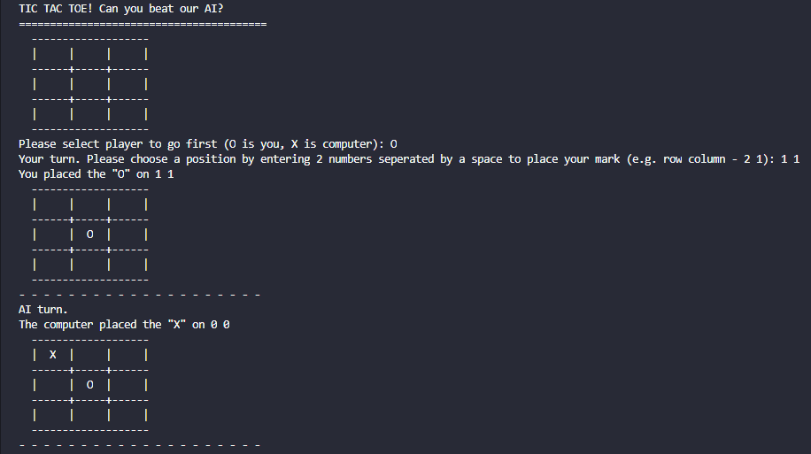
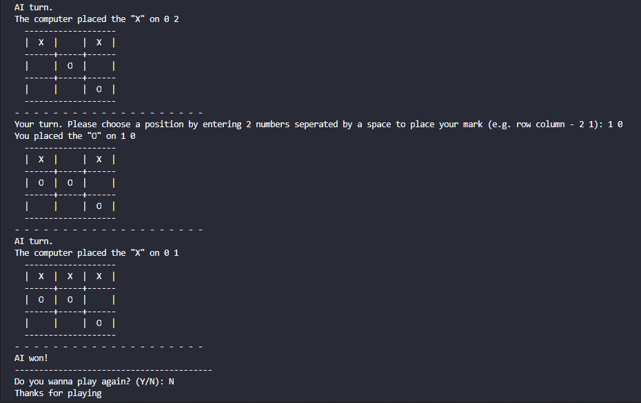

# Simple Python TicTacToe game using Minimax Alpha-Beta_Pruning

This is a TicTacToe game using Minimax Algorithm with Alpha-Beta Pruning. It will choose the move with maximum score when it is the AI's turn and choose the move with the minimum score when it is the human player's turn. Using this strategy in this game, AI player avoids losing to the human player.

### Minimax Algorithm
Minimax is used in decision making and game theory to find the optimal move for a player assuming that the other player is also playing optimally. It's widely used in two player turn-based games such as Tic-Tac-Toe, Chess, Mancala, Go, etc.

### Alpha-Beta Pruning
Alpha–beta pruning is a search algorithm that seeks to decrease the number of nodes that are evaluated by the minimax algorithm in its search tree. - [Wikipedia](https://en.wikipedia.org/wiki/Alpha%E2%80%93beta_pruning)

### How to play
- First, clone the repo
```git clone https://github.com/lannguyen0910/minimax_tictactoe```

- Second, go to repo folder 
```cd */minimax_tictactoe```

- Third, run the game using the command
```python play.py```

### Result
 
### Preference
Youtube: The Coding Train -> [link](https://www.youtube.com/watch?v=trKjYdBASyQ&feature=emb_logo)
